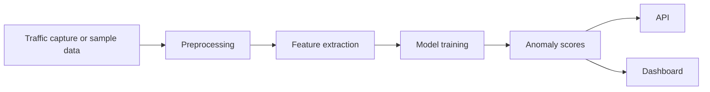

# Net.AI - Network Anomaly Detection Prototype

Net.AI is a cybersecurity and ML prototype for network anomaly detection. It covers the core workflow from traffic capture and preprocessing to model training, API exposure, and dashboard review.

## Recruiter Quick Look

| What to check | Why it matters |
| --- | --- |
| [Live surface](https://siddhantdamre.github.io/Net.AI/) | Fast overview of the project concept and next demo path. |
| `traffic_capturer.py` | Traffic capture workflow. |
| `data_preprocessor.py`, `preprocess.py` | Feature preparation and cleaning. |
| `model_trainer.py`, `train_model.py` | Training pipeline. |
| `api.py`, `dashboard.py` | Service and visualization surfaces. |
| `run_pipeline.py` | End-to-end orchestration path. |
| `docs/DEMO_ROADMAP.md` | Plan for a safe synthetic traffic demo. |

## Problem

Network anomaly detection is only useful if the workflow is reproducible: collect or ingest traffic, extract features, train a model, expose results, and make suspicious activity understandable. Net.AI sketches that full path instead of stopping at a single notebook.

## Architecture

## Tech Stack

`Python` `Packet Capture` `Anomaly Detection` `ML Training` `API` `Dashboard` `Cybersecurity`

## Repository Map

| Path | Purpose |
| --- | --- |
| `traffic_capturer.py` | Capture workflow. |
| `data_preprocessor.py`, `preprocess.py` | Data preparation. |
| `model_trainer.py`, `train_model.py` | Model training. |
| `api.py` | API entry point. |
| `dashboard.py` | Dashboard surface. |
| `run_pipeline.py` | End-to-end pipeline runner. |

## Current Demo State

The GitHub Pages surface explains the project and portfolio context. The next strong version is a Streamlit dashboard backed by safe synthetic traffic data or a sanitized sample dataset.

## Roadmap

- Add `examples/` with synthetic traffic samples.
- Add a one-command demo path using sample data.
- Add screenshots of anomaly charts and dashboard output.
- Add Docker support for repeatable local review.
- Add clear notes on safe/ethical use and no live network capture required for demo mode.

## License

MIT
